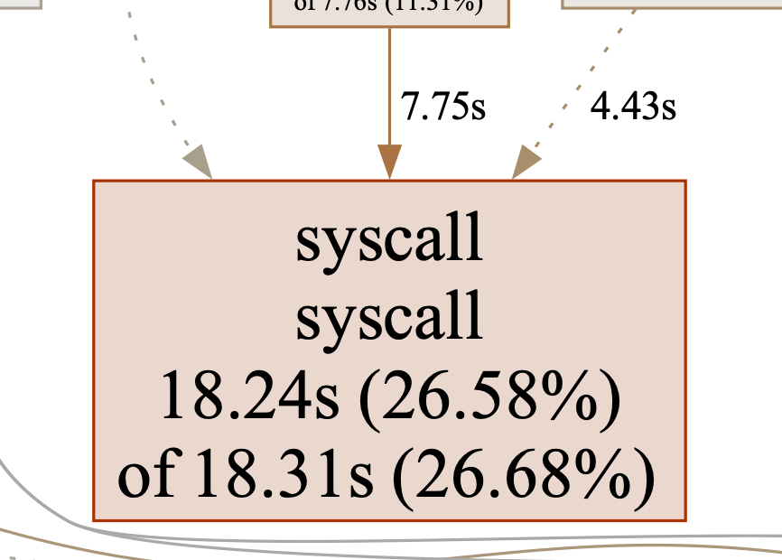

  

<h3 align="center">Enron Corp - Optimization</h3>

## 1st Phase - Initial Profiling: After Backend Development

The initial indexing process involved uploading a batch of emails scanned from various directories into the ZincSearch database running on a Docker container. This task was performed using Go routines to parallelize the batch uploads, aiming to speed up the process.

These are some common specifications that were chosen as initial assumptions:

- 10 worker nodes were used to process files in parallel. This number of nodes was chosen based on examples found online that utilized Go routines.

- Channels were employed to synchronize the data for the batches to be sent. This was useful as different routines were in use. Channels were also used to manage the file paths obtained from directory scanning and to close the WaitGroup, signaling when the program was finished.

- Batches of 1,000 messages were sent to avoid overloading the service. This was done using the [create multi](https://zincsearch-docs.zinc.dev/api/document/multi/) request, as it is more efficient than uploading documents one by one and can accept multiple lines of documents in a single request, unlike the bulk request.

- If the process failed to upload, a wait time of 2 seconds before another retry was established to try to upload the batch again.

The time taken for this initial process was not recorded. However, a profiling graph was obtained and can be found as a PDF in the [initial directory](../profiling/initial/).

## 2nd Phase - Mid Profiling: After Integration with Frontend

Following the integration with the frontend, several improvements were made to the indexer:

- Packages were utilized to better organize the functions used in the indexer.

- Sorting was not implemented for the `content`, `from`, and `to` attributes in the email index because the index was not pre-configured with the correct sorting settings. To address this, index creation was added as part of the indexer before initializing the worker nodes.

- **Most importantly:** The time taken to execute the program was not recorded during the initial phase. Recording this is crucial for benchmarking future optimizations.

With the current configuration and the changes made, the execution time was recorded as follows:

|                        | Test 1   | Test 2   | Test 3  | Test 4   | Test 5   |
| ---------------------- | -------- | -------- | ------- | -------- | -------- |
| **Execution Time (s)** | 3m 58.5s | 3m 37.5s | 3m 6.9s | 3m 35.5s | 3m 37.8s |
| **Total Documents**    | 512,907  | 512,963  | 512,963 | 512,963  | 513,177  |

The execution time does not directly correlate with the total time it takes to upload all the documents via concurrent requests. It takes several minutes for the container running ZincSearch to handle all the requests sent by the program.

Additionally, there are some inconsistencies when uploading the documents, as the total number of documents varies. This issue is due to the Internal Server errors obtained when sending the requests and will be further investigated during the optimization phase.

**The average execution time of the program was 215.24 seconds (3m 35.24s), with approximately 512,995 documents successfully uploaded.**

The profiling graph for this phase can be found as a PDF in the [mid directory](../profiling/mid/).

## 3rd Phase - Final Profiling: Optimization

### Code Optimization

#### Syscall

 

Syscall is a low-level function that accesses the system directly, often due to file operations with the `os` package, such as `Read`, `Write`, and similar functions.

The first improvement involved checking the file size before processing. Large files caused ZincSearch container to fail and the program to retry the request. To address this, files larger than 400 KB were skipped, reducing batch processing errors and avoiding handling files up to 1-2 MB. As a result, 9 files were not uploaded, but the number of successfully uploaded files increased to 517,416, compared to 512,995 previously.

Given the large file sizes, it was necessary to use a buffered reader (`bufio`) instead of a scanner or `ioutil` to optimize file reading operations.

Additionally, it is important to close the file as soon as all operations are complete, as keeping it open can be costly. Therefore, files are now closed immediately after reading the content.

#### Usleep

The `Time.Sleep()` function was used for retries when a request failed. The issue was not the number of requests but the file size, which has now been addressed. As a result, no Internal Server Errors (500) are expected, and the retry function has been removed to optimize lines of code and as subsequent tests have shown no retry errors.

#### String Concatenation

To improve the efficiency of the `processEmailFiles` function, string concatenation was optimized by using `strings.Builder` instead of simpler concatenation methods.

### Code Readability

Significant refactoring was done to balance code efficiency with readability. The goal was to reduce the 3m 30s mark, while also improving batch upload consistency. The current optimizations have brought the execution time down to approximately 2m 45s, a significant improvement.

However, to enhance code clarity, packages were added or renamed, and the previous code was split into more obvious functions to increase reusability. The requests made to ZincSearch are now defined in more straightforward functions. This refactoring slightly increased the execution time to approximately 2m 48s, but it remains within an acceptable range.

### Benchmarking Go Worker Nodes

Max worker nodes are not a bottleneck.

| **Number of worker nodes** | 10  | 20  | 40  | 60  | 80  |
| -------------------------- | --- | --- | --- | --- | --- |
| **Execution Time (s)**     |     |     |     |     |     |
| **Total Documents**        |     |     |     |     |     |

### Benchmarking Batches of Messages Sent

|                        | Test 1 | Test 2 | Test 3 | Test 4 | Test 5 |
| ---------------------- | ------ | ------ | ------ | ------ | ------ |
| **Execution Time (s)** |        |        |        |        |        |
| **Total Documents**    |        |        |        |        |        |

The profiling graph for this phase can be found as a PDF in the [final directory](../profiling/final/).

## ⚠️ Notice

