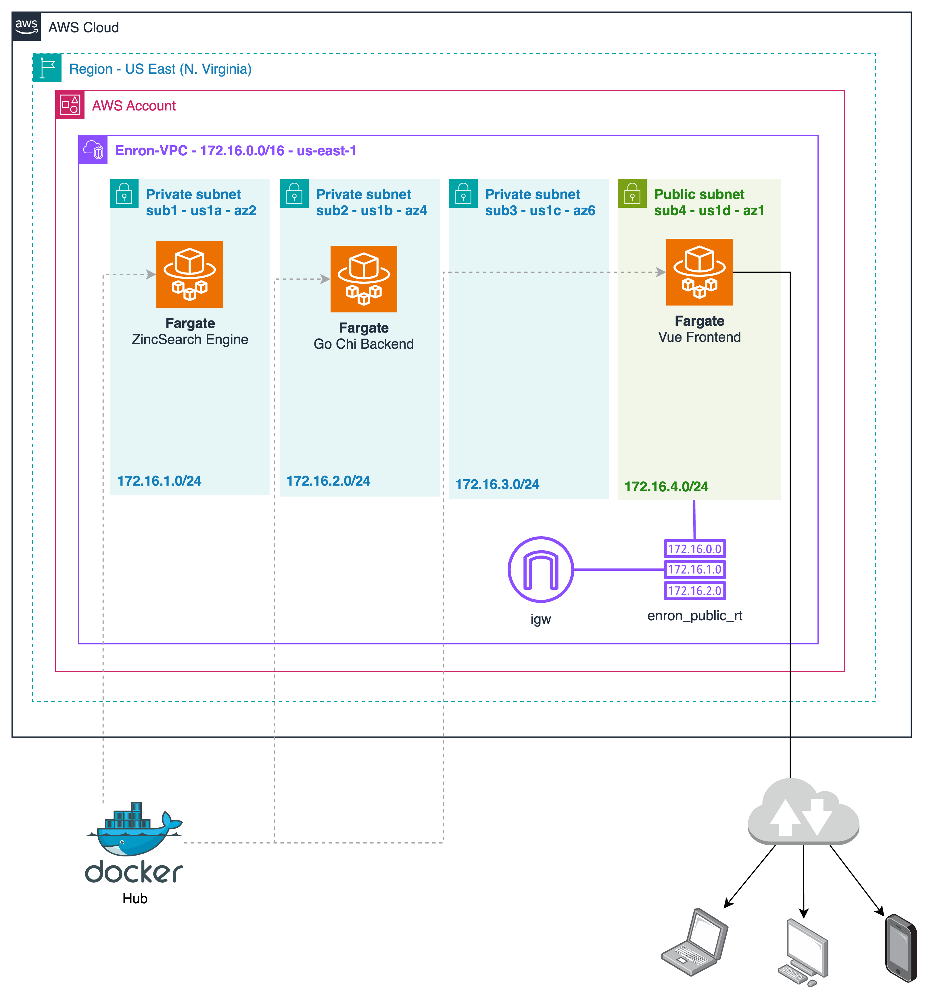

<p align="center">
  <a href="" rel="noopener">
 </a>
</p>

<h3 align="center">Enron Corp - Deploy</h3>

## Planning

The following diagram outlines the deployment of our services within the AWS Cloud. The infrastructure is designed with a combination of private and public subnets to host the various services. Since Docker is already in use for local development, the Docker images are pushed to Docker Hub. ECS Fargate is then utilized to run these images in tasks, allowing for external access via public IP addresses assigned to the Fargate tasks.

<div align="center">

</div>
</br>

In this diagram, the services are deployed on AWS Cloud. However, for cost savings and local development, **LocalStack** is employed to run the services on a local machine, simulating an AWS environment.

Additionally, **Terraform** is used to automate the creation of the infrastructure, ensuring consistency and efficiency.

## Phase 1: Running LocalStack

To begin, install the [LocalStack CLI](https://docs.localstack.cloud/getting-started/installation/). Create an account on LocalStack and retrieve your [Auth Token](https://docs.localstack.cloud/getting-started/auth-token/). This deployment was performed with a "Hobby" subscription, which is currently free for non-commercial use.

Set up your Auth Token locally:

```bash
localstack auth set-token <YOUR_AUTH_TOKEN>
```

Next, start the LocalStack container in the background:

```bash
localstack start -d
```

## Phase 2: Terraform Deployment with LocalStack

To integrate Terraform with LocalStack, install the [terraform-local](https://github.com/localstack/terraform-local) wrapper script. Ensure you have the necessary prerequisites installed:

```bash
pip install terraform-local
```

Navigate to the Terraform directory within the project, then initialize and apply the Terraform configurations, which are pre-configured with all necessary infrastructure and point to the latest Docker images for the Backend, Frontend, and ZincSearch services:

```bash
cd terraform/
tflocal init
tflocal apply -auto-approve
```

Once applied, you should see four Docker containers running: one for the LocalStack default container, and three representing the Backend, Frontend, and ZincSearch Fargate services.

## Phase 3: Allowing LocalStack Host in Fargate Service Containers

By default, LocalStack runs instances on `localhost.localstack.cloud`. More information can be found [here](https://docs.localstack.cloud/references/network-troubleshooting/endpoint-url/). However, the Fargate containers are not initially exposed to this domain, preventing them from communicating with each other. To resolve this, the domain host needs to be added to the Frontend and Backend containers. ZincSearch does not require this step as it does not requests communication with the other containers.

To allow the host, run the following script from the Terraform directory in the project:

```bash
./allowHost
```

The Docker images uploaded are pre-configured to work with these known hosts.

Now, you can open [http://localhost.localstack.cloud/](http://localhost.localstack.cloud/) and the application will be running using LocalStack.

## Phase 4: Indexing Emails

To populate the database with email data, use the indexing script:

```bash
cd ../
./indexer enron_mail_20110402
```

Once the script has completed and all the requests are processed, the emails will be accessible from the deployed site.
